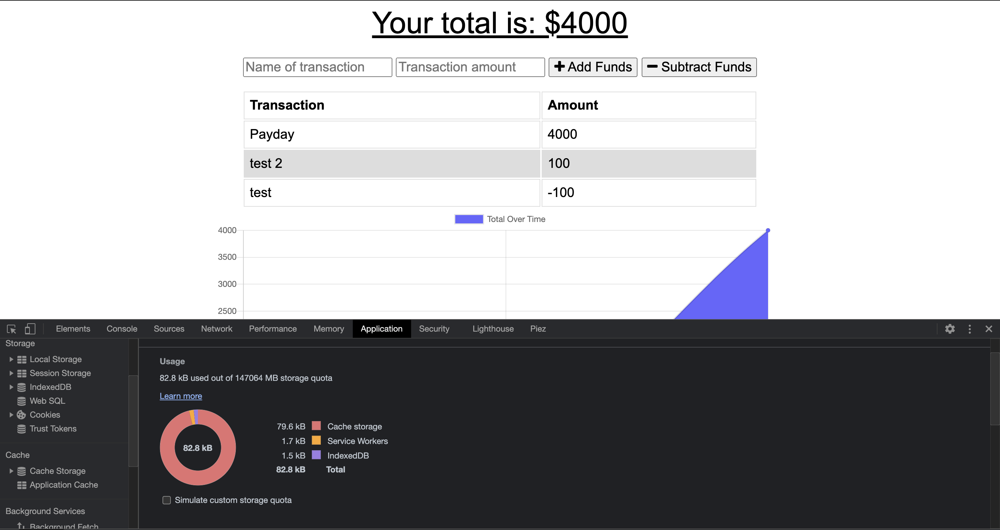

# progressive-budget

The progressive budget app allows you to enter incoming and outgoing payments both on and offline. The app is deployed to Heroku and uses MongoDB Atlas to store the data. IndexedDB allows data to be cached locally when offline and updates the database with any offline transactions once reconnected.

[Deployed site](https://powerful-plains-13679.herokuapp.com/)

